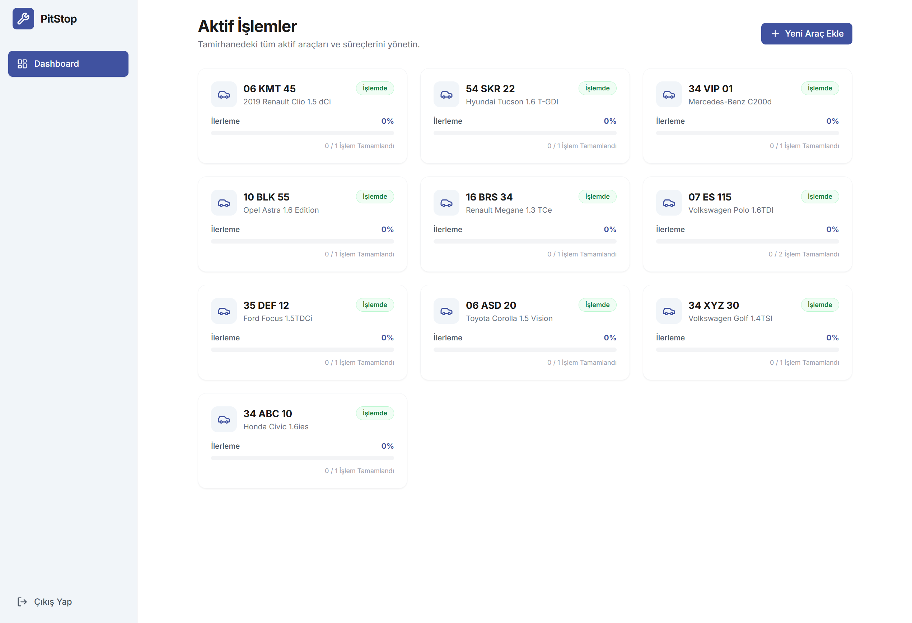
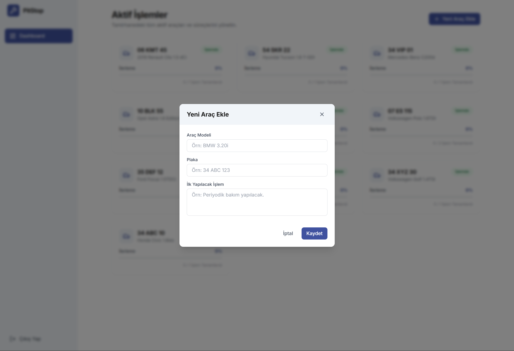
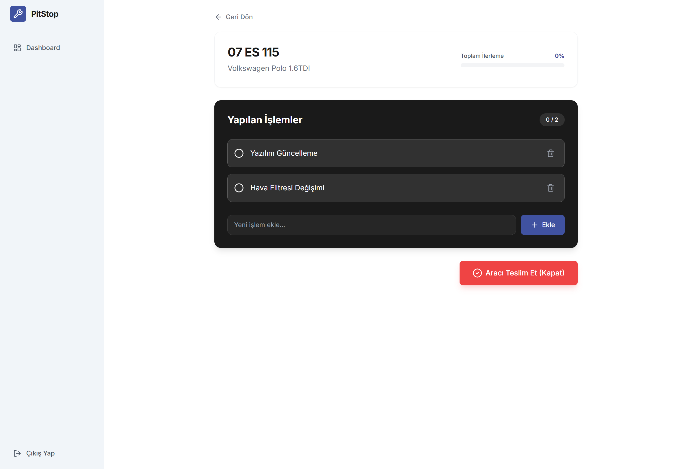

# PitStop

Bu proje, eğitim programı çerçevesinde elde edilen modern web geliştirme becerilerinin pratik bir uygulamasıdır. Katılımcıların öğrendikleri teorik kavramları bütüncül bir şekilde kullanarak hayallerindeki fikirleri hayata geçirmelerini hedefler. Temel amaç, modern web dünyasına girişi hızlandırmak ve eğitim sürecindeki kazanımları pekiştirmektir.

Giriş ekranı fonksiyonel bir kullanıcı adı - eğitim kapsamında olduğu için şifre doğrulaması yapmamaktadır. Herhangi bir e-posta yapısı ve şifre ile giriş yapılabilir.

Örn: 

  E-posta Adresi : admin@pitstop.com
  Şifre : admin
  
  Netlify : https://pitstop-hrjdev.netlify.app/
  
## 📸 Ekran Görüntüleri
Aşağıda uygulamanın çeşitli sayfalarından görünümler yer almaktadır:






## 🚀 Teknolojiler
- **Frontend Framework:** React (Vite)
- **Stil & Tasarım:** Tailwind CSS
- **Veritabanı & Backend:** Supabase
- **İkonlar:** Lucide React
- **Yönlendirme (Routing):** React Router DOM

## 🛠️ Kurulum ve Çalıştırma

Projeyi yerel ortamınızda çalıştırmak için aşağıdaki adımları izleyin:

### 1. Projeyi Klonlayın
```bash
git clone https://github.com/Hrjdev/PitStop.git
cd PitStop
```

### 2. Bağımlılıkları Yükleyin
```bash
npm install
```

### 3. Çevre Değişkenlerini Ayarlayın
Projenin ana dizininde `.env.example` dosyasının bir kopyasını oluşturup adını `.env` yapın. İçerisindeki değişkenleri kendi Supabase projenize göre doldurun.
```bash
cp .env.example .env
```

`.env` dosyanız şu şekilde görünmelidir:
```env
VITE_SUPABASE_URL=https://<your-project>.supabase.co
VITE_SUPABASE_PUBLISHABLE_KEY=<your-publishable-key>
```

### 4. Geliştirme Sunucusunu Başlatın
```bash
npm run dev
```
Uygulama varsayılan olarak `http://localhost:5173` adresinde çalışacaktır.

## 📦 Üretime Hazırlık (Build)
Projeyi yayına almak üzere build etmek için:
```bash
npm run build
```
Bu komut sonucunda optimize edilmiş statik dosyalar `dist/` klasörü içerisinde oluşturulacaktır.

## 📝 Veritabanı Şeması
Supabase veritabanı tablolarını oluşturmak için gerekli SQL sorguları `supabase_schema.sql` dosyasında bulunmaktadır. Bu içeriği Supabase panelindeki SQL Editor üzerinden çalıştırarak gerekli tabloları kurabilirsiniz.
